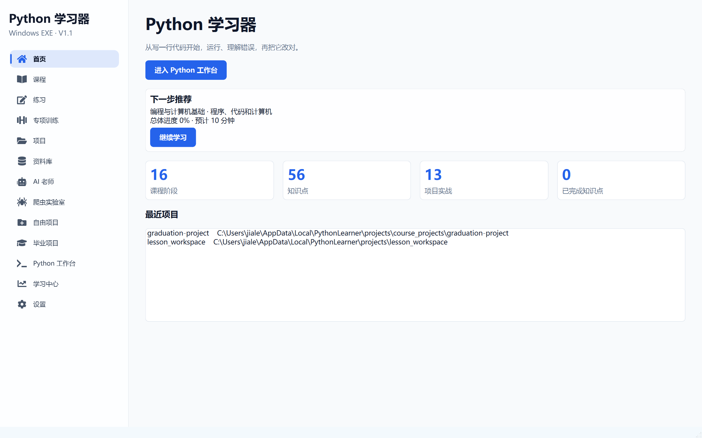
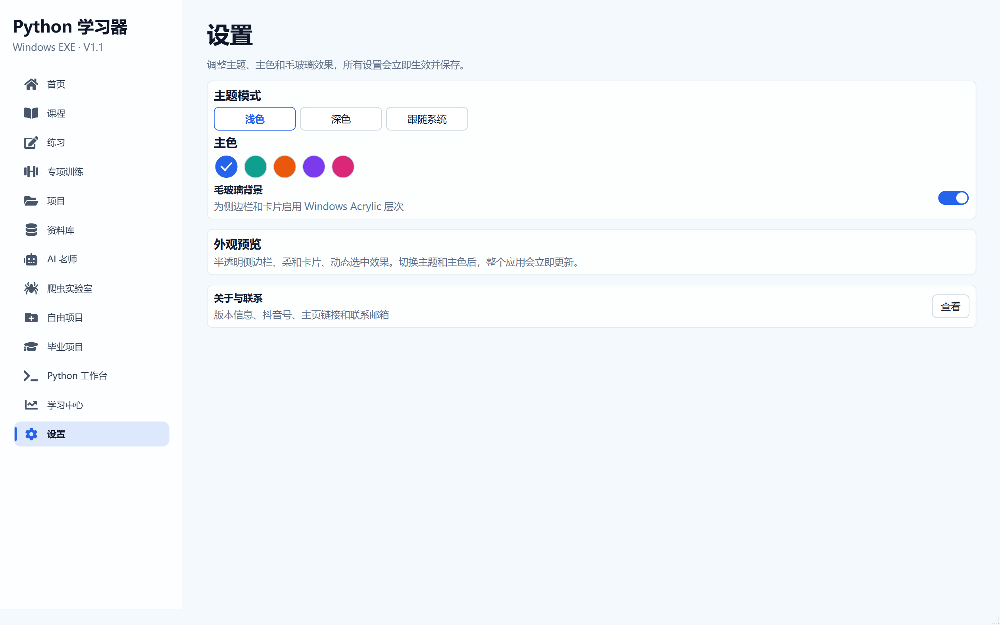

# 阶段 10 验收记录：导航、菜单与主题优化

验收日期：2026-09-13

## 开发范围

- 带图标的侧边导航
- 移除冗余顶部菜单栏
- 主题模式切换
- 主色切换
- Windows 毛玻璃背景
- Telegram 风格悬停和选中动画
- 页面切换取消高开销淡入，保持流畅

## 验收清单

- [x] 侧边栏包含 13 个功能入口
- [x] 所有导航项在 1100 × 700 窗口下完整显示
- [x] 每个导航项都有对应功能图标
- [x] 导航项支持悬停动画
- [x] 当前导航项有强调色圆角背景和左侧指示条
- [x] 移除重复的顶部菜单栏
- [x] 设置页包含浅色、深色和跟随系统
- [x] 设置页包含 5 种主色
- [x] 主题与主色设置立即生效
- [x] Windows 11 Acrylic 毛玻璃可以启用和关闭
- [x] 页面切换无卡顿
- [x] 设置重启后仍然保留
- [x] 设置页使用分段主题控件、圆形色板和开关
- [x] 毕业项目使用环形进度和高级里程碑列表
- [x] 全局使用清晰的中文 UI 字体
- [x] 关于页面包含抖音号 `62868461635`
- [x] 关于页面包含主页 `https://v.douyin.com/wA4Df70HOgE/`

## 自动测试证据

```text
53 passed
```

## 打包验收

- [x] `dist\PythonLearner\PythonLearner.exe` 启动成功
- [x] 窗口标题为“Python 学习器”
- [x] 打包版主程序响应正常
- [x] QtAwesome 图标字体已包含在打包版本中
- [x] Windows Acrylic 毛玻璃调用返回成功
- [x] `PythonWorker.exe` 中文输出正常

## 界面验收截图




