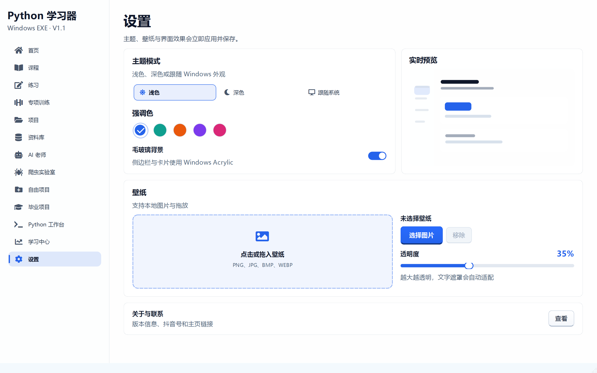
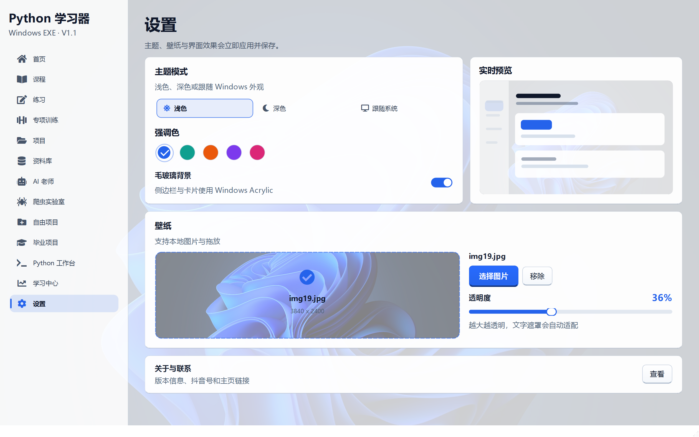
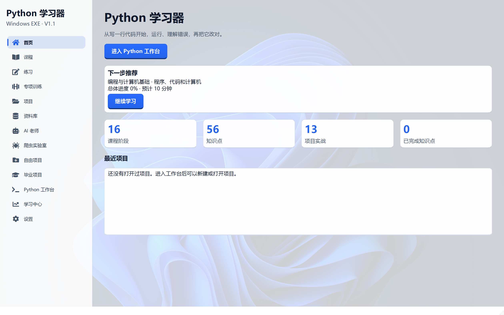
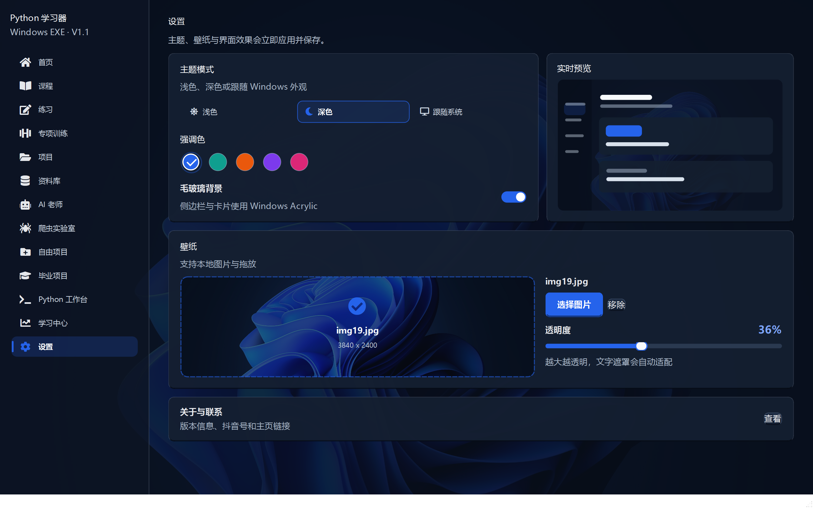
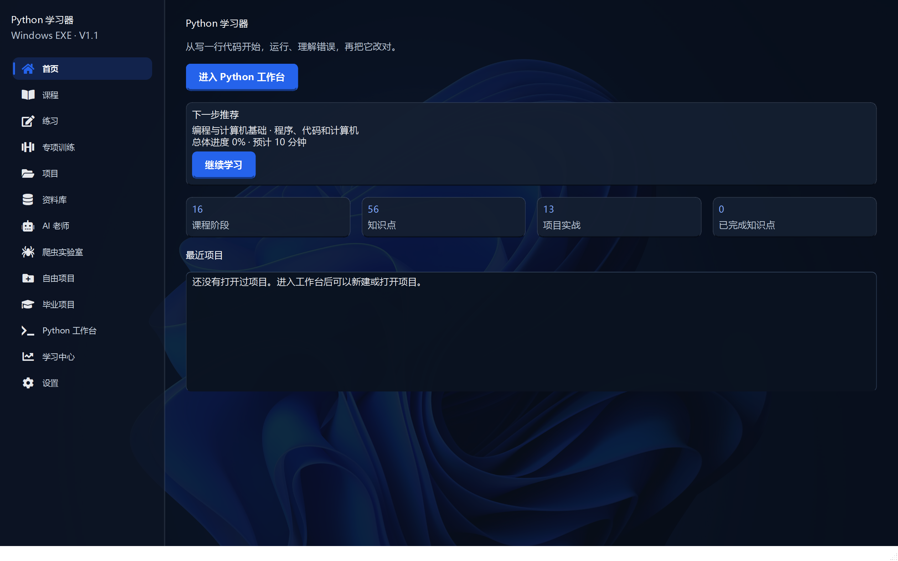
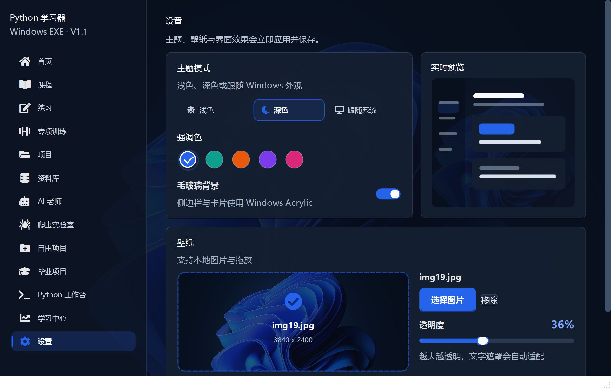

# 阶段 11 验收记录：主题工作室与自定义壁纸

验收日期：2026-09-14

## 开发范围

- 重构设置页主题区域
- 新增三段式主题模式切换动画
- 新增强调色悬停与选中动画
- 新增实时外观预览
- 新增本地壁纸上传与拖放
- 新增壁纸预览和透明度滑杆
- 壁纸主题与设置持久化
- 全局文字锐度和对比度优化

## Uiverse 参考

Uiverse 官网由 Cloudflare 防护，本次使用其公开的
[`uiverse-io/galaxy`](https://github.com/uiverse-io/galaxy) 组件库完成同源检索。

最终选择并转译了以下交互语言：

- `JkHuger/itchy-turtle-45`：主题开关的日月切换与滑块拉伸反馈
- `Type-Delta/happy-mule-45`：浅色、深色切换的平滑旋转和缩放
- `Yaya12085/tender-moose-95`：图片上传卡片的虚线边框、图标和点击区域
- `boryanakrasteva/strong-cat-50`：玻璃层次和悬停时的轻微聚焦

这些案例仅作为交互与视觉参考，最终控件均使用 PySide6 原生绘制，不引入网页运行时。

## 验收清单

- [x] 主题模式提供浅色、深色和跟随系统
- [x] 当前主题使用带强调色边框的滑块反馈
- [x] 主题切换和色板悬停均有 150 至 190 毫秒动画
- [x] 设置页提供实时界面预览
- [x] 支持点击选择本地图片作为壁纸
- [x] 支持将图片直接拖入壁纸区域
- [x] 支持 PNG、JPG、JPEG、BMP 和 WEBP
- [x] 显示壁纸文件名和原始分辨率
- [x] 透明度支持 0% 至 90%
- [x] 可以移除当前壁纸
- [x] 壁纸路径和透明度会写入设置文件
- [x] 重启后恢复壁纸和透明度
- [x] 浅色、深色主题下均显示壁纸
- [x] 壁纸启用时自动增加内容遮罩
- [x] 卡片、输入框、侧边栏使用不同强度遮罩
- [x] 深色滚动容器不再残留亮色底板
- [x] 正文改用更深的次级文字色和更高字重
- [x] 全局字体提升至 11pt 并启用完整字符提示
- [x] 1440 × 900 桌面验收通过
- [x] 1100 × 700 最小窗口验收通过

## 自动测试证据

```text
53 passed in 192.82s
```

## 打包验收

- [x] `PythonLearner.exe` 启动成功
- [x] 深色主题、青绿色强调色和自定义壁纸配置正常加载
- [x] 窗口标题为“Python 学习器”
- [x] 主程序响应正常
- [x] 主窗口可以正常关闭
- [x] `PythonWorker.exe` 中文输出验证通过

发布包 SHA-256：

```text
e453591856c19972111626ccdfa14e87e7eebf72cdf8bac5be5f1c843f49dad7
```

## 界面验收截图












