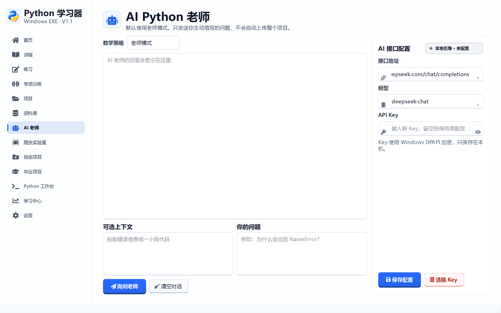
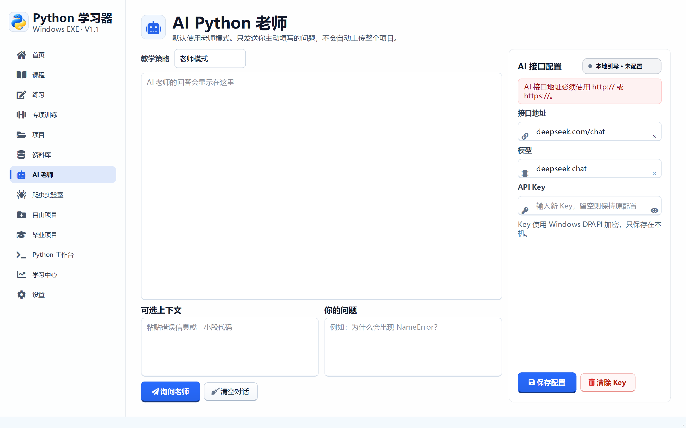
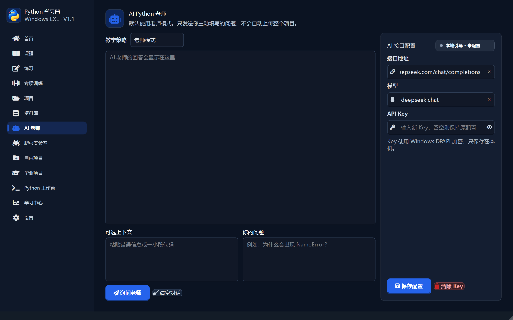
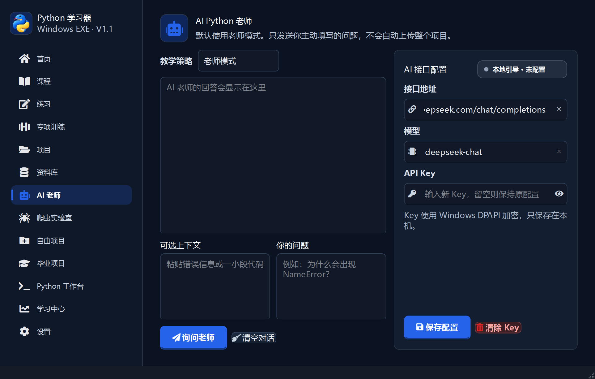

# 阶段 12 验收记录：应用图标与 AI 接口配置重构

验收日期：2026-09-14

## 开发范围

- 使用用户提供的图片制作透明应用图标
- 输出包含 16 至 256 像素的多尺寸 ICO
- 接入侧边栏品牌、窗口、任务栏和打包 EXE
- 重构 AI 老师接口配置区
- 修复接口地址、模型和 API Key 输入框过小的问题
- 将配置错误改为独立、可换行的消息区域
- 增加主题状态、请求状态和发送过程动画

## Uiverse 参考

使用公开的
[`uiverse-io/galaxy`](https://github.com/uiverse-io/galaxy) 组件库检索后，
选取并转译了以下简洁交互：

- `adamgiebl/thin-lionfish-5`：三点脉冲状态动画
- `adamgiebl/smart-moth-68`：发送按钮纸飞机图标
- `barisdogansutcu/gentle-pig-32`：Key 输入图标和简洁输入反馈

最终效果使用 PySide6 原生绘制，不引入网页运行时。

## 验收清单

- [x] 使用用户提供的图片作为软件图标
- [x] 移除原图连续白色背景
- [x] 图标生成透明 PNG 和多尺寸 ICO
- [x] 侧边栏品牌显示应用图标
- [x] 主窗口和对话框使用应用图标
- [x] 打包 EXE 使用应用图标
- [x] AI 配置区改为右侧独立栏
- [x] 接口地址、模型、API Key 输入框高度恢复为 38 像素以上
- [x] 输入框增加链接、模型和 Key 图标
- [x] API Key 支持显示和隐藏
- [x] 配置错误显示在配置栏内，不再只写入聊天区
- [x] 错误消息支持换行和完整显示
- [x] 本地模式、联网模式和请求状态拥有不同颜色
- [x] 联网状态和请求状态具有脉冲动画
- [x] 请求过程中发送按钮显示旋转图标
- [x] 深色主题和壁纸模式下配置栏保持清晰
- [x] 1440 × 900 桌面验收通过
- [x] 1100 × 700 最小窗口验收通过

## 界面验收截图









## 自动测试证据

```text
53 passed in 212.24s
```

## 打包验收

- [x] `PythonLearner.exe` 使用多尺寸 ICO
- [x] 打包图标包含透明通道
- [x] `PythonLearner.exe` 启动成功
- [x] 窗口标题为“Python 学习器”
- [x] 主程序响应正常
- [x] 主窗口可以正常关闭
- [x] `PythonWorker.exe` 中文输出验证通过

发布包 SHA-256：

```text
bd05810af686e555357ffc565f6963b8e08b579066aac19bff41566f5dd2d0a2
```
