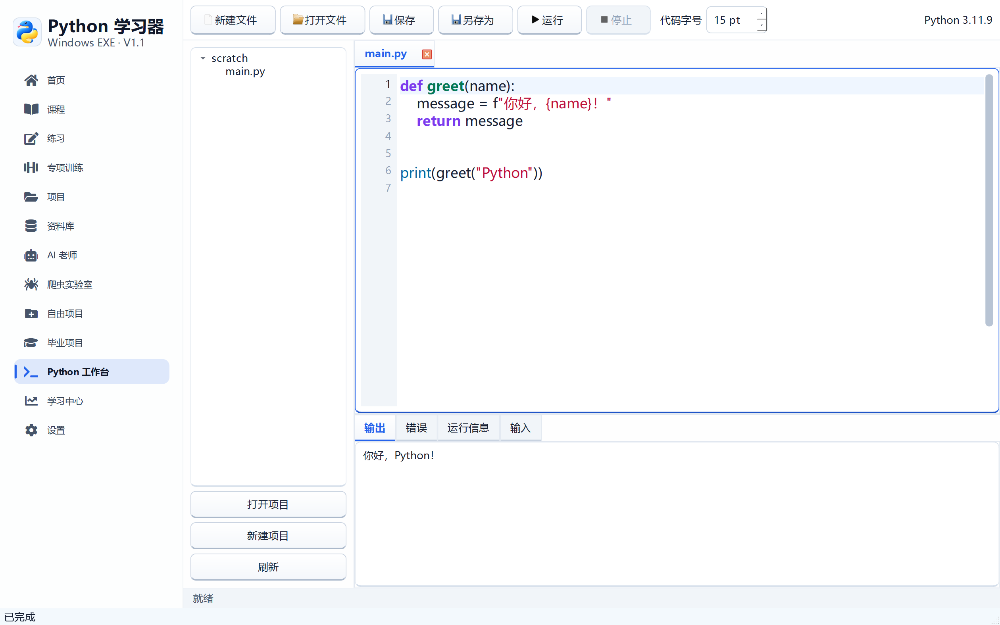
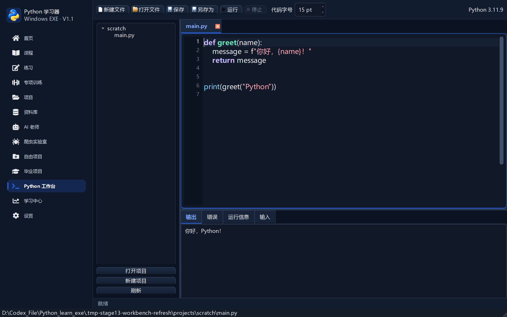
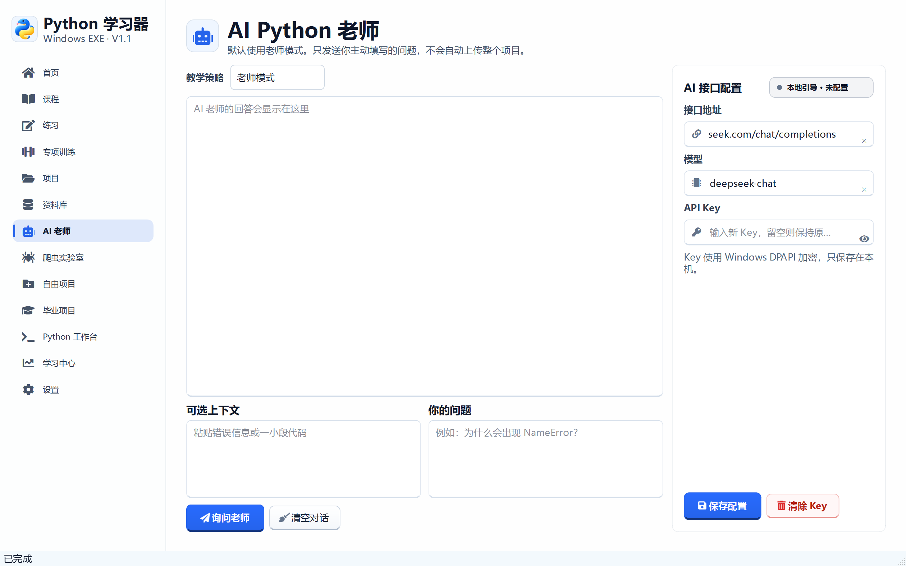
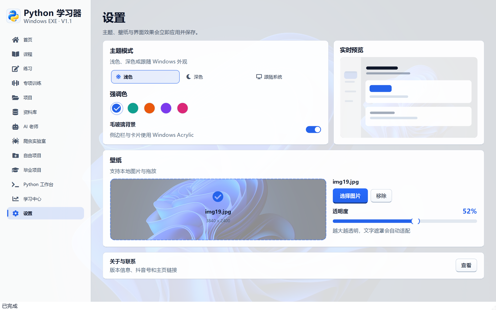

# 阶段 13 验收记录：任务栏图标、工作台与丝滑滚动

验收日期：2026-09-14

## 开发范围

- 修复 Windows 任务栏图标关联
- 修正 AI 接口输入图标错位
- 工作台自动创建并打开可编辑草稿
- 工作台支持代码高亮、直接运行和字号调节
- 优化透明度和壁纸滑块的连续拖动性能
- 为页面滚动增加缓出动画和触摸惯性
- 优化侧边导航图标动画

## Uiverse 参考

- `3bdel3ziz-T/dangerous-newt-76`：图标按钮的位移、缩放和悬停反馈
- `adamgiebl/thin-lionfish-5`：加载与状态点的轻量脉冲
- `adamgiebl/smart-moth-68`：运行与发送图标的动态反馈

Uiverse 没有专门的滚动容器组件。本次保留其轻量缓动原则，
滚动使用原生 Qt 动画与触摸惯性，避免引入网页运行时。

## 验收清单

- [x] 设置稳定的 Windows AppUserModelID
- [x] 打包 EXE 内嵌透明应用图标
- [x] 窗口图标与任务栏图标使用同一套 ICO
- [x] AI 接口输入图标固定在输入框左侧并垂直居中
- [x] 进入工作台自动创建 `scratch/main.py`
- [x] 草稿文件可以直接输入、保存和运行
- [x] 编辑器保留 Python 语法高亮、行号和括号匹配
- [x] 工作台可以调整代码字号
- [x] 代码字号写入设置并在重启后恢复
- [x] 深色主题使用独立代码配色
- [x] 壁纸拖动期间不再写设置文件
- [x] 壁纸拖动期间不再重复解码原图
- [x] 透明度停止拖动后才保存
- [x] 91 级连续透明度更新约 1.4 秒
- [x] 页面滚轮使用 190ms 缓出动画
- [x] 支持的设备使用触摸惯性滚动
- [x] 侧边导航图标具有轻微位移和放大反馈
- [x] 1440 × 900 和 1100 × 700 验收通过

## 自动测试证据

```text
55 items passed
```

## 界面验收截图









## 打包验收

- [x] `PythonLearner.exe` 启动成功
- [x] 窗口标题为“Python 学习器”
- [x] 主程序响应正常
- [x] 主窗口可以正常关闭
- [x] 打包 EXE 提取图标包含透明通道
- [x] `PythonWorker.exe` 中文输出验证通过

发布包 SHA-256：

```text
1f8112a77454412337e4a6859737fdcab348aaaa6f56fc5886c5b533f19267e4
```
