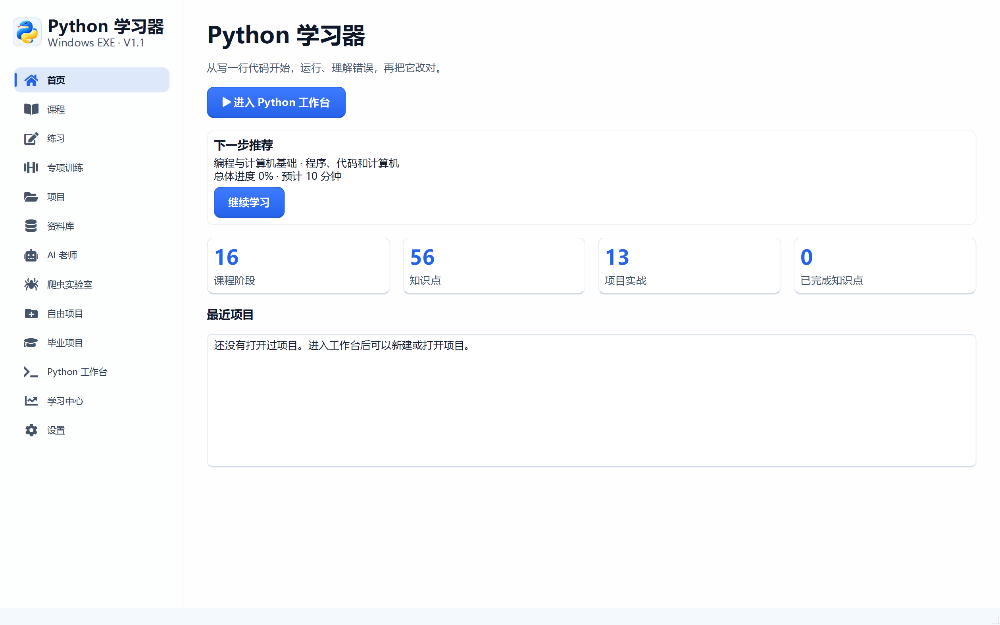
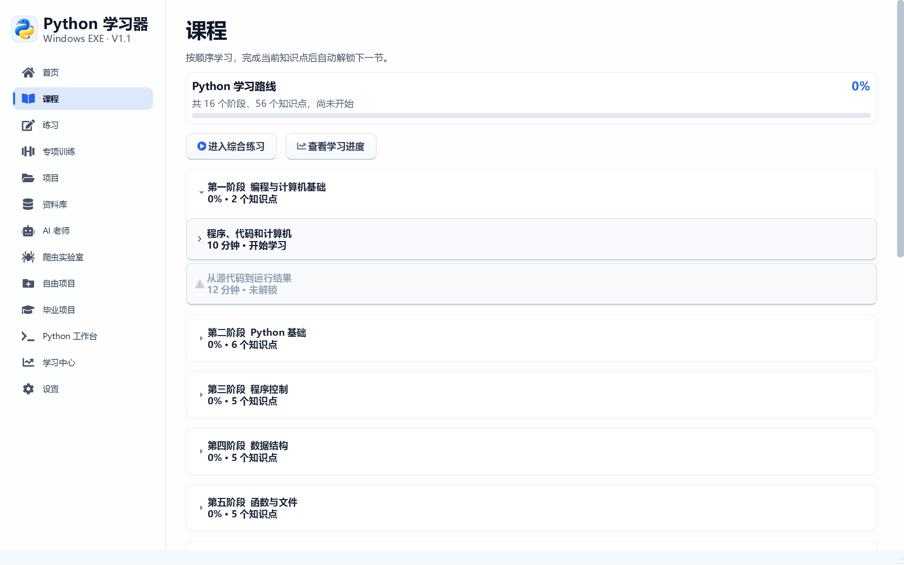
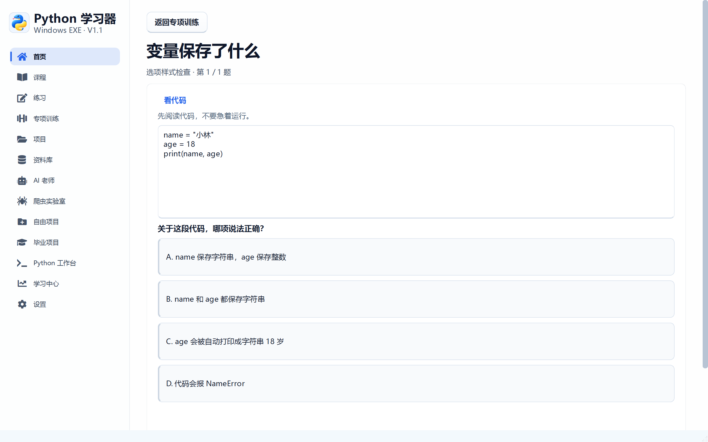
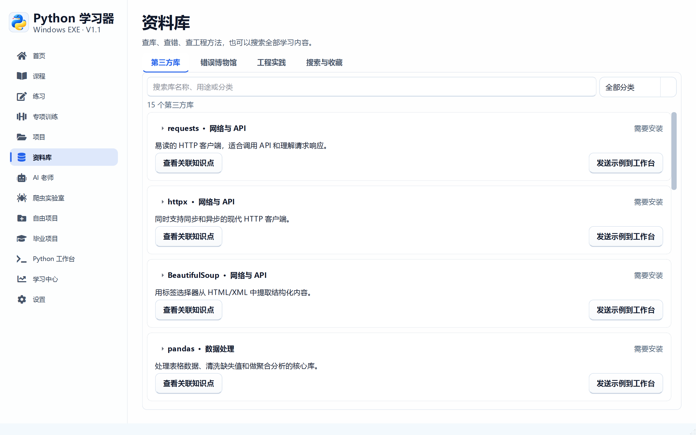
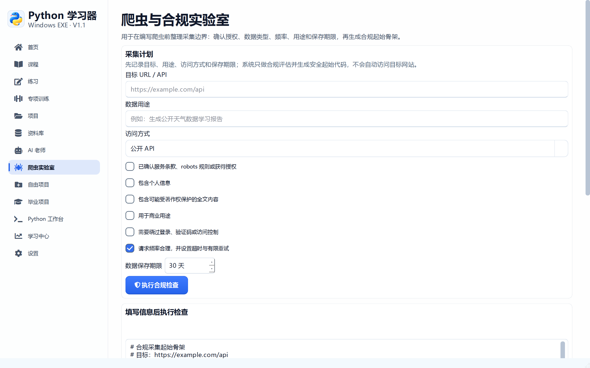
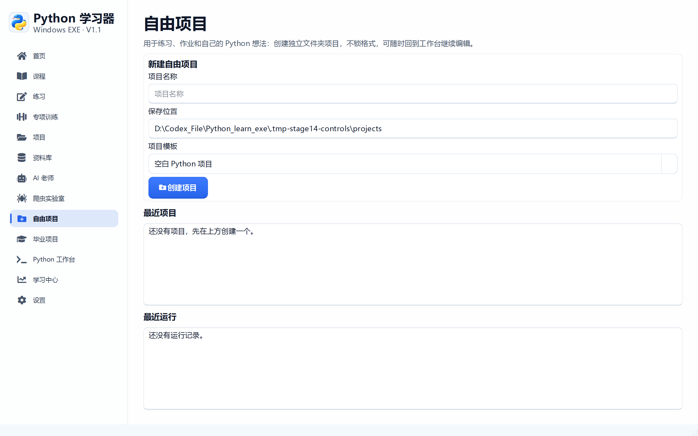

# 阶段 14 验收记录：交互控件视觉统一

验收日期：2026-09-14

## 开发范围

- 主按钮改为单层渐变、图标和轻薄按下反馈
- 次级按钮改为简约描边与悬停染色
- 答题选项改为整块卡片和左侧状态条
- 标签页改为轻量分段式导航
- 下拉选择框统一圆角、边框和悬停反馈
- 采集合规勾选项改为原生绘制动画
- 补充采集计划和自由项目的用途说明

## Uiverse 参考

参考 Uiverse 中以下简约交互方向：

- `Bodyhc/great-walrus-67`：单层按钮表面和明确按下反馈
- `3bdel3ziz-T/dangerous-newt-76`：图标悬停位移与缩放
- `adamgiebl/new-bird-34`：简约图标按钮
- `barisdogansutcu/gentle-pig-32`：简洁输入和勾选反馈

控件没有直接复制网页代码，均使用 PySide6 原生绘制和 Qt 样式实现。

## 功能说明

### 采集计划

采集计划是“爬虫编码前的合规设计表”，不是自动爬虫。

用户需要先填写目标地址、数据用途、访问方式、数据类型、保存期限和授权情况。
系统据此给出风险分、注意事项和安全采集起始代码，帮助用户理解合法边界。
它不会自动访问目标网站，也不会绕过登录、验证码或访问控制。

### 自由项目

自由项目是脱离课程顺序的独立 Python 工程空间。

它适合保存练习、作业、工具脚本和个人想法。用户可以选择空白、基础或带测试的模板，
创建后会在工作台中打开标准文件夹，并记录最近项目和运行历史，方便以后继续编辑。

## 验收清单

- [x] 主按钮使用单层渐变和图标
- [x] 次级按钮使用简约描边和悬停染色
- [x] 答题选项使用卡片和左侧状态条
- [x] 正确、错误和答案状态具有独立颜色
- [x] 标签页选中状态使用强调色和底部指示线
- [x] 下拉选择框统一圆角和焦点反馈
- [x] 采集勾选项支持悬停和选中动画
- [x] 深色与浅色主题下控件对比度清晰
- [x] 采集计划明确提示不会自动访问目标网站
- [x] 自由项目说明其独立工程和继续编辑用途
- [x] 1440 × 900 和 1100 × 700 验收通过

## 自动测试证据

```text
55 items passed
```

## 界面验收截图













## 打包验收

- [x] `PythonLearner.exe` 启动成功
- [x] 主程序响应正常
- [x] 主窗口可以正常关闭
- [x] `PythonWorker.exe` 中文输出验证通过

发布包 SHA-256：

```text
6670a8abf4f04d61dc02a91a95cb317be54ef188592186aaaf134db29c00e459
```
