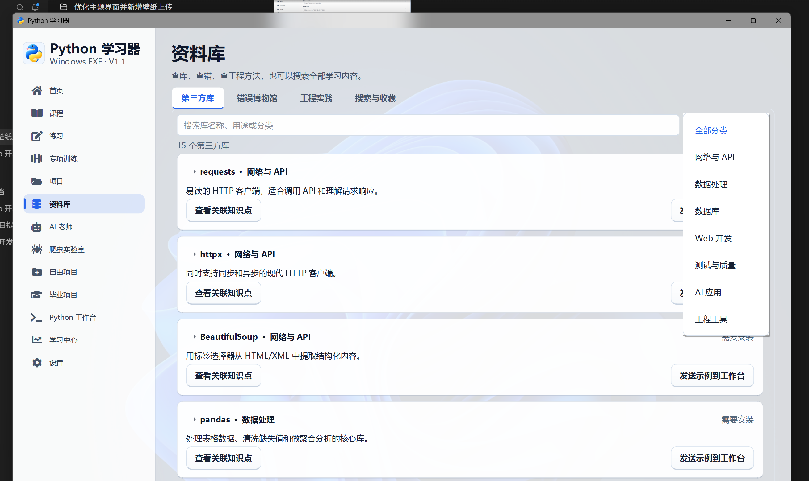
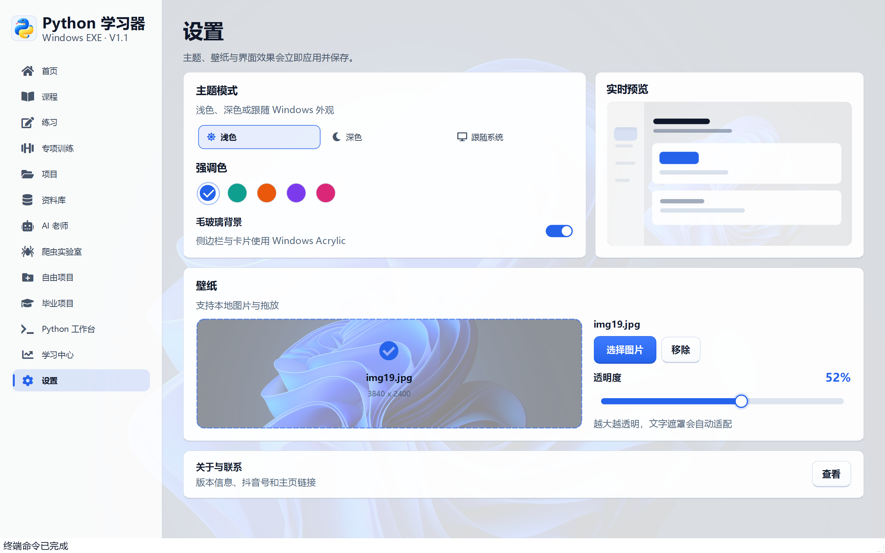
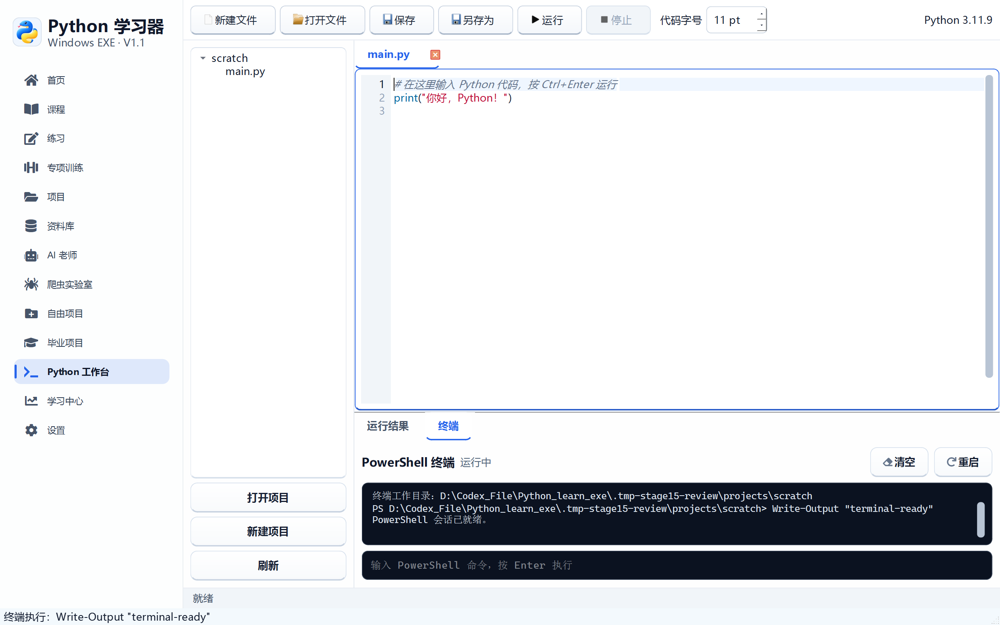
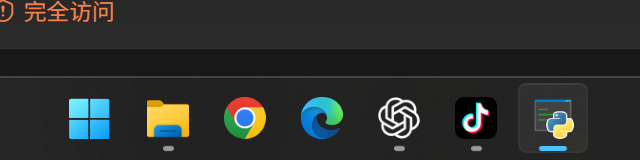

# 阶段 15 验收记录：终端、下拉框与滑块优化

验收日期：2026-09-14

## 开发范围

- 修复下拉框弹层仍使用系统默认样式的问题
- 重做透明度滑块，移除被裁切的半圆滑柄
- 加强 Windows 任务栏图标关联
- 在 Python 工作台加入 PowerShell 终端
- 支持在终端安装 Python 库
- 让安装的库可以被工作台运行环境直接导入

## 交互与性能

- 下拉框使用自定义箭头、圆角弹层、行间距和选中色
- 透明度滑块使用原生绘制轨道、进度和圆形滑柄
- 滑块拖动时只更新缓存背景，不重复写盘或解码图片
- 91 级连续更新约 1.4 秒，接近 64 帧每秒
- 任务栏使用透明 ICO、PNG 补充尺寸和稳定 AppUserModelID

## 工作台终端

终端与“运行结果”并排显示，支持：

- `pip install 包名`
- `py -m pip install 包名`
- `python -m pip install 包名`
- `cd`、`Get-ChildItem` 等普通 PowerShell 命令
- 清空、重启和安装库快捷按钮

普通 `pip install` 会被转为软件内置安装流程，库安装到
`%LOCALAPPDATA%\PythonLearner\packages`。Python Worker 运行代码时会自动读取该目录，
因此安装完成后可以直接 `import`。

## 验收清单

- [x] 下拉框不再显示旧式方形系统弹层
- [x] 下拉框支持自定义圆角、宽度和行高
- [x] 滑块不再出现被裁切的半圆滑柄
- [x] 滑块支持悬停放大和按下反馈
- [x] 透明度仍可实时调节，保存逻辑保持防抖
- [x] 任务栏显示蓝黄色应用图标
- [x] EXE 内嵌透明多尺寸图标
- [x] 工作台增加“终端”页签
- [x] 终端使用持续 PowerShell 会话
- [x] 终端可以安装库并显示安装输出
- [x] 安装库到软件自己的持久化目录
- [x] 工作台运行环境自动读取已安装库
- [x] 终端支持清空、重启和安装库按钮
- [x] 关闭软件时终端进程会退出
- [x] 1440 × 900 和 1100 × 700 验收通过

## 自动测试证据

```text
58 items passed
```

## 界面验收截图









## 打包验收

- [x] `PythonLearner.exe` 启动成功
- [x] 主程序响应正常
- [x] 主窗口可以正常关闭
- [x] 打包版 `PythonWorker.exe --pip-install --version` 正常
- [x] `PythonWorker.exe` 中文输出验证通过

发布包 SHA-256：

```text
2a734753a48f572d301643d26902038cf42a279242a7ca41bdb3a24caf72ee5b
```
