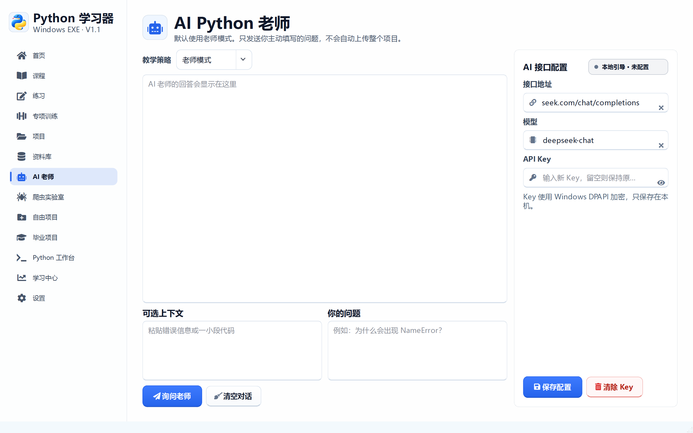
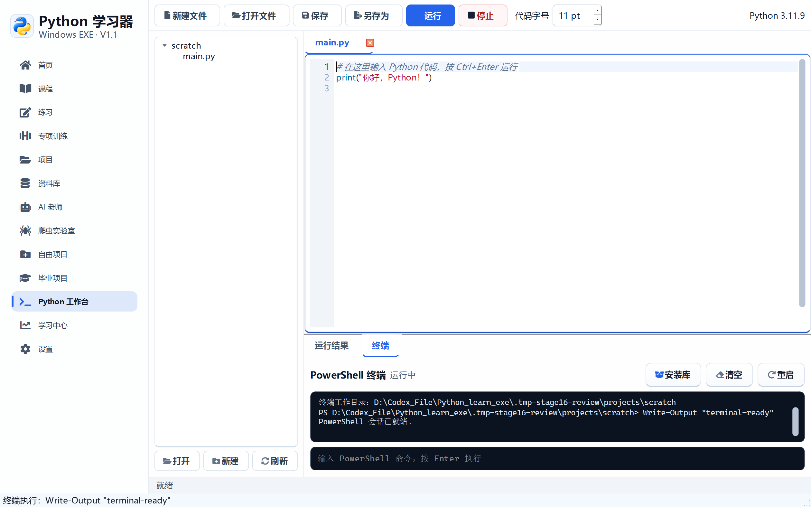

# 阶段 16 验收记录：工作台界面与 AI 输入图标

验收日期：2026-09-14

## 开发范围

- 优化工作台工具栏视觉和布局
- 替换工作台系统默认图标
- 优化文件树底部操作按钮
- 修复 AI 输入框右侧操作图标对齐
- 更新任务栏 AppUserModelID，强制任务栏重新关联图标

## 工作台界面

- 新建、打开、保存、另存为使用统一线性图标
- 运行按钮使用强调色，停止按钮使用红色语义
- 文件树底部改为紧凑的“打开、新建、刷新”按钮
- 编辑器、运行结果和终端保持清晰分区
- 代码编辑区仍支持语法高亮、字号调节和直接运行

## AI 输入图标

- 接口、模型和 Key 左侧图标由输入框自行绘制
- 清除操作不再使用系统默认圆形叉号
- 清除、显示和隐藏图标固定为 13 至 16 像素
- 所有图标垂直居中，不再随输入框 padding 偏移

## 验收清单

- [x] 工作台工具栏使用统一图标
- [x] 运行和停止按钮具有明确颜色语义
- [x] 文件树操作按钮改为紧凑横向布局
- [x] 工作台窗口标签页和终端间距正常
- [x] AI 接口左侧图标垂直居中
- [x] AI 清除图标改为自绘图标
- [x] API Key 显示/隐藏图标垂直居中
- [x] 浅色和深色主题下图标对比度正常
- [x] 任务栏使用版本化 AppUserModelID
- [x] 1440 × 900 和 1100 × 700 验收通过

## 自动测试证据

```text
58 items passed
```

## 界面验收截图





## 打包验收

- [x] `PythonLearner.exe` 启动成功
- [x] 主程序响应正常
- [x] 主窗口可以正常关闭
- [x] `PythonWorker.exe` 中文输出和 `pip` 安装入口正常

发布包 SHA-256：

```text
2a734753a48f572d301643d26902038cf42a279242a7ca41bdb3a24caf72ee5b
```
