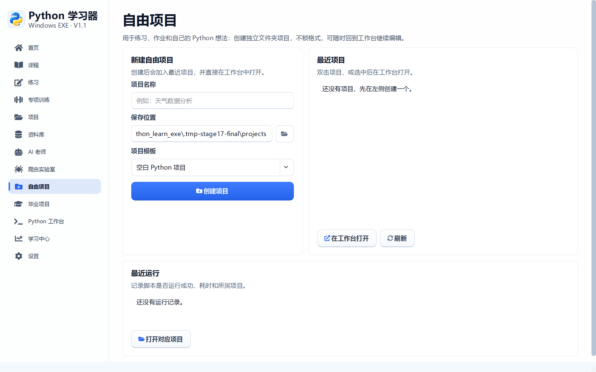
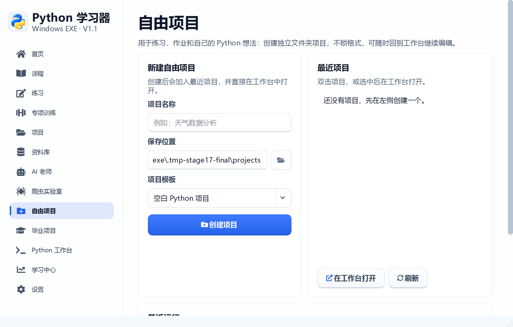

# 阶段 17 验收记录：自由项目布局与任务栏图标

验收日期：2026-09-14

## 开发范围

- 重排自由项目页面
- 优化工作台工具栏和文件树操作
- 修正 AI 输入框操作图标
- 从根本上修复任务栏图标
- 重新打包验证

## 自由项目布局

- 左侧固定显示新建项目表单
- 右侧显示最近项目，可直接打开或刷新
- 底部集中显示最近运行记录
- 最小窗口下使用滚动，不再压缩或遮挡表单
- 保存位置增加文件夹选择按钮
- 所有操作按钮增加语义图标

## 工作台布局

- 新建、打开、保存、另存为、运行、停止统一为线性图标
- 运行按钮使用强调色，停止按钮使用红色
- 文件树操作缩减为“打开、新建、刷新”紧凑按钮
- 代码编辑器、运行结果和终端保持独立区域

## 任务栏图标

此前只依赖 Qt 设置窗口图标，打包后任务栏仍可能使用通用窗口类图标。
本次增加 Win32 原生处理：

- 设置版本化 AppUserModelID
- `WM_SETICON` 写入小图标和大图标
- 设置窗口类 `GCLP_HICON` 与 `GCLP_HICONSM`
- 刷新窗口框架和任务栏缓存
- 打包后从任务栏截图验证图标

## 验收清单

- [x] 自由项目页面改成左右分栏
- [x] 最近项目和最近运行分别显示
- [x] 最小窗口下页面可以滚动
- [x] 表单内容不再重叠
- [x] 工作台工具栏使用统一图标
- [x] 文件树操作按钮更紧凑
- [x] AI 输入图标和清除图标垂直居中
- [x] 打包程序任务栏显示蓝黄色应用图标
- [x] 任务栏图标不再显示通用窗口图标
- [x] 1440 × 900 和 1100 × 700 验收通过

## 自动测试证据

```text
58 items passed
```

## 界面验收截图






## 打包验收

- [x] `PythonLearner.exe` 启动成功
- [x] 主程序响应正常
- [x] 主窗口可以正常关闭
- [x] 打包程序任务栏图标验证通过
- [x] `PythonWorker.exe` 中文输出和 `pip` 安装入口正常

发布包 SHA-256：

```text
21651088c6ac1c58db460b79ce745145233234d408a7d463ee8f3fb94cd97706
```
