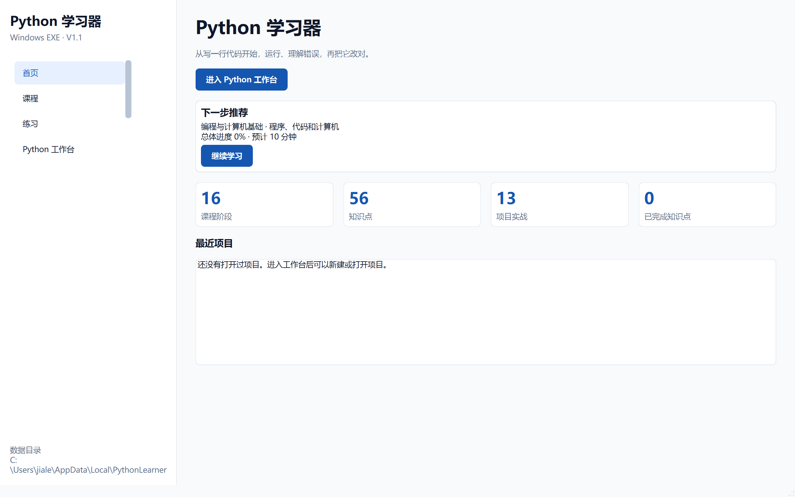
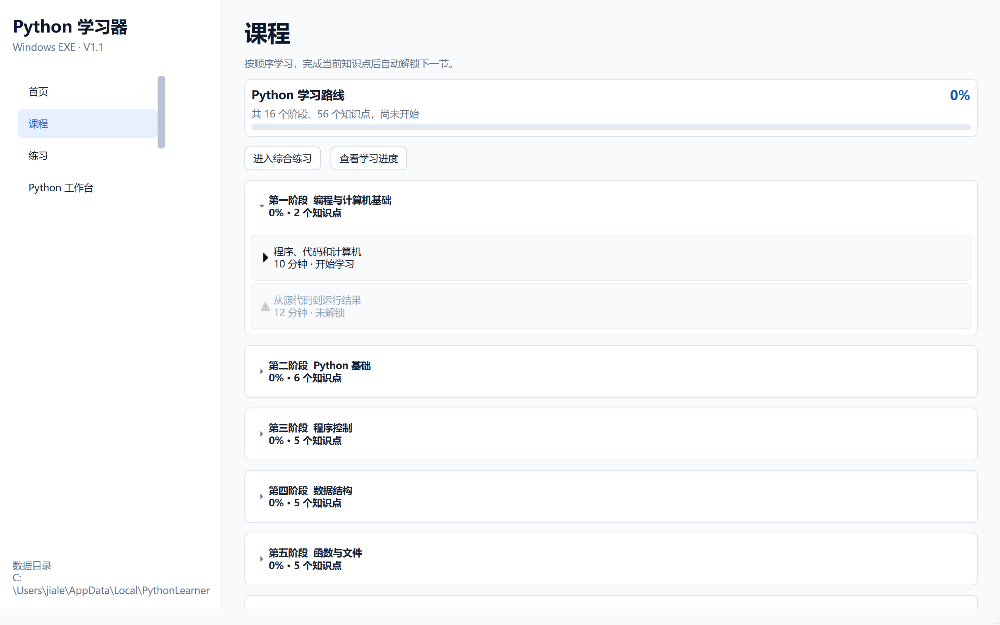
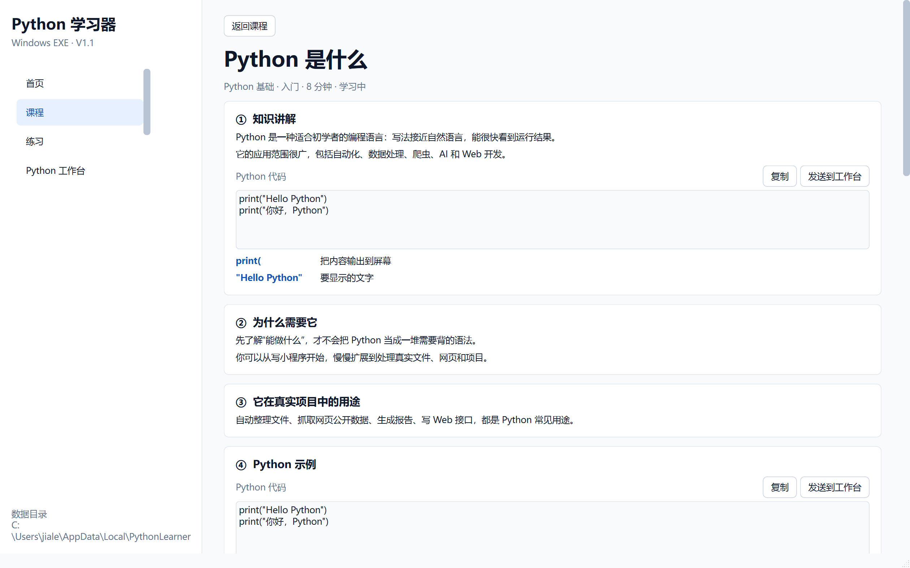
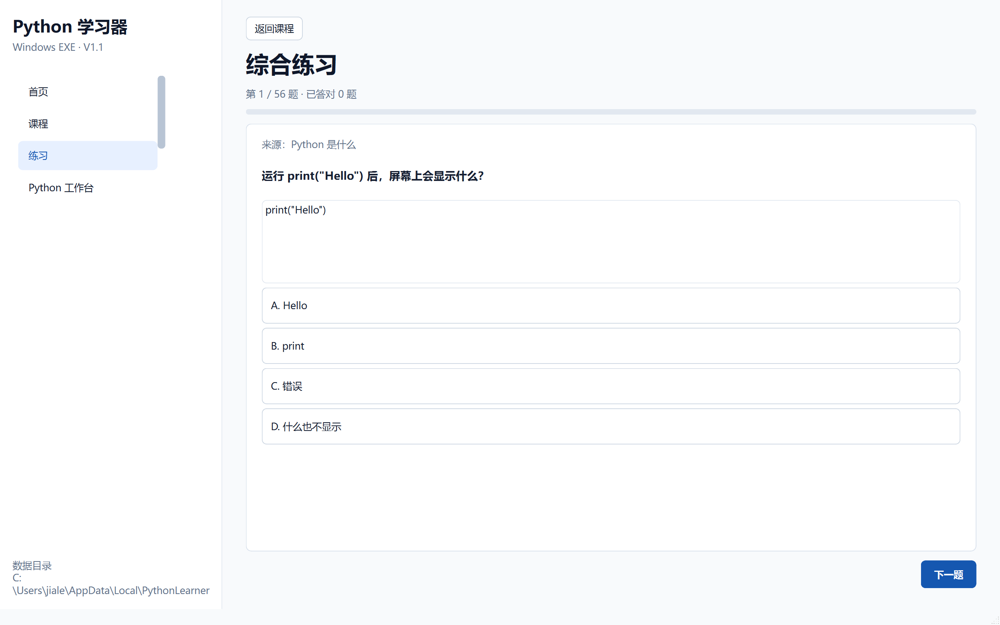
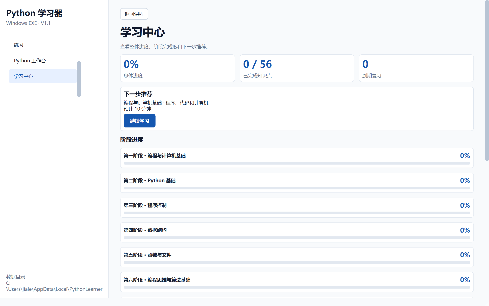

# 阶段 2 验收记录：课程与学习闭环

验收日期：2026-09-13

## 开发范围

- 16 个课程阶段和 56 个知识点列表
- 知识点十段内容
- 课程小练习和综合练习
- 顺序解锁
- 完成课程
- 本地进度持久化
- 首页继续学习推荐
- 学习中心阶段进度
- 课程代码发送到 Python 工作台

## 验收清单

- [x] 侧边栏包含首页、课程、练习、Python 工作台、学习中心
- [x] 课程页显示 16 个阶段
- [x] 课程页显示 56 个知识点
- [x] 新用户只能进入第一个知识点
- [x] 后续知识点按顺序锁定
- [x] 知识点详情包含知识讲解、原因、用途、示例、运行、小练习、错误、项目用法、法律说明和下一步
- [x] 小练习答错会记录，答对会解除错题状态
- [x] 完成当前知识点后解锁下一节
- [x] 综合练习读取全部课程小练习
- [x] 综合练习会显示答题进度和结果
- [x] 课程代码可以发送到 Python 工作台
- [x] 学习中心显示总体进度、完成数量和阶段进度
- [x] 首页推荐下一个未完成知识点
- [x] 关闭并重新启动后，课程完成状态仍然存在
- [x] 深浅色主题下页面文字和代码可读

## 自动测试证据

执行：

```powershell
.\.venv\Scripts\python.exe -m pytest
```

结果：

```text
24 passed
```

阶段专项测试位于：

```text
tests/test_stage2_acceptance.py
tests/test_learning.py
```

## 打包验收

- [x] `dist\PythonLearner\PythonLearner.exe` 启动后窗口标题为“Python 学习器”
- [x] 打包后的主程序响应正常
- [x] `PythonWorker.exe` 输出 `Stage 2 package OK`
- [x] 打包目录未包含错误的第三方 ICU DLL

## 界面验收截图










