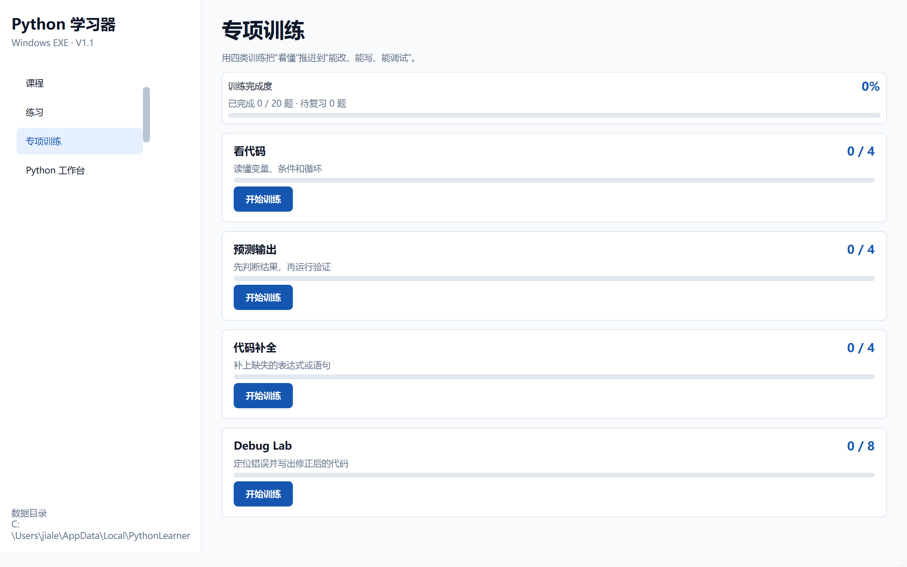
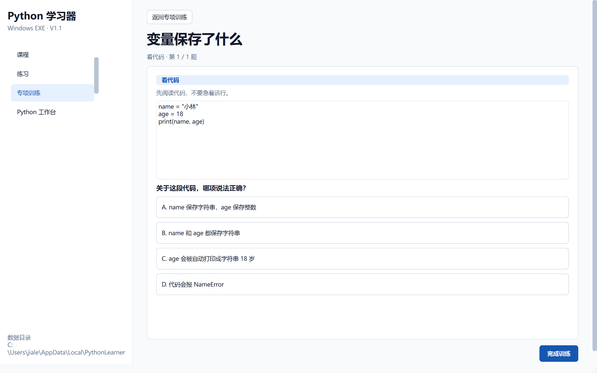
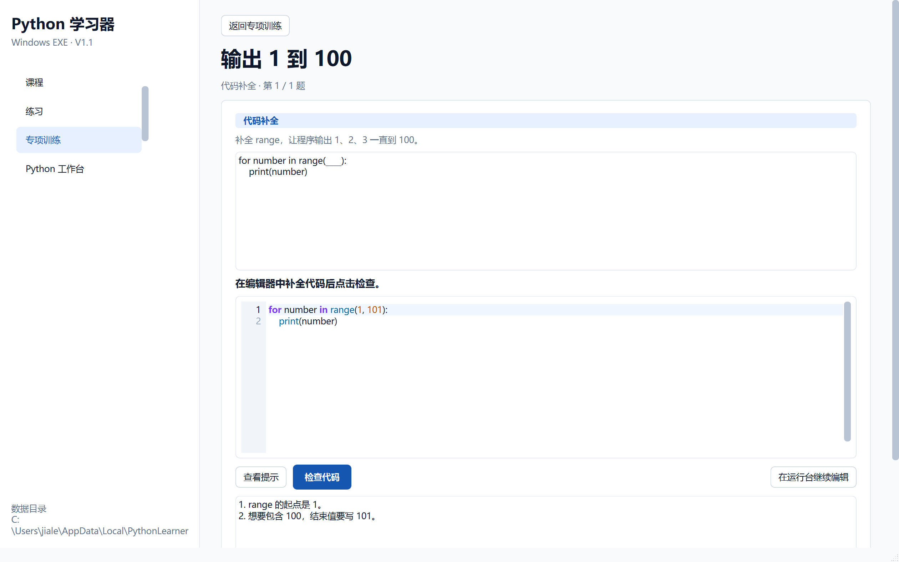
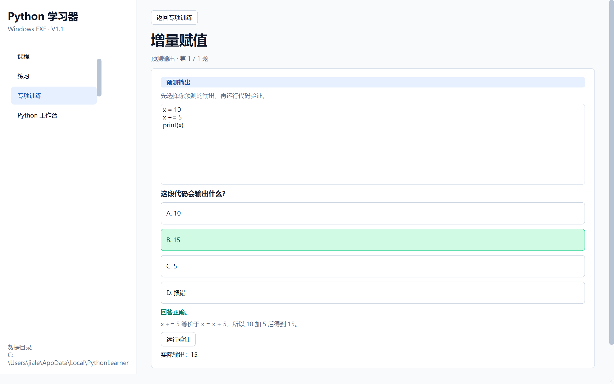

# 阶段 3 验收记录：专项训练与错题复习

验收日期：2026-09-13

## 开发范围

- 四类专项训练：看代码、预测输出、代码补全、Debug Lab
- 20 道训练题
- 选择题判题
- 代码结构判题
- 预测输出实际运行验证
- 分级提示和参考实现
- 训练代码发送到 Python 工作台
- 训练进度和错题持久化
- 错题复习模式

## 验收清单

- [x] 侧边栏增加“专项训练”
- [x] 训练中心显示四类训练的完成度
- [x] 看代码包含 4 道题
- [x] 预测输出包含 4 道题
- [x] 代码补全包含 4 道题
- [x] Debug Lab 包含 8 道题
- [x] 选择题答错会进入错题复习
- [x] 选择题答对会解除对应错题状态
- [x] 预测输出可以选择答案并实际运行 Python 验证
- [x] 代码补全会检查必要结构和错误残留
- [x] Debug Lab 可以检查修复结果
- [x] 提示可展开查看
- [x] 答错后可以查看参考实现
- [x] 代码可以发送到 Python 工作台
- [x] 训练结果在重新启动后仍然保留
- [x] 训练中心可以只复习错题
- [x] 中文输出在 UTF-8 管道分段时仍能正确显示

## 自动测试证据

执行：

```powershell
.\.venv\Scripts\python.exe -m pytest
```

结果：

```text
28 passed
```

阶段专项测试位于：

```text
tests/test_training.py
```

## 打包验收

- [x] `dist\PythonLearner\PythonLearner.exe` 启动后窗口标题为“Python 学习器”
- [x] 打包后的主程序响应正常
- [x] `PythonWorker.exe` 输出 `Stage 3 package OK`
- [x] 预测输出所使用的真实 Worker 运行链路可用
- [x] 中文输出专项测试通过

## 界面验收截图








