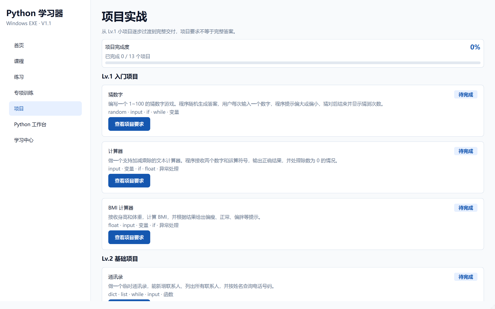
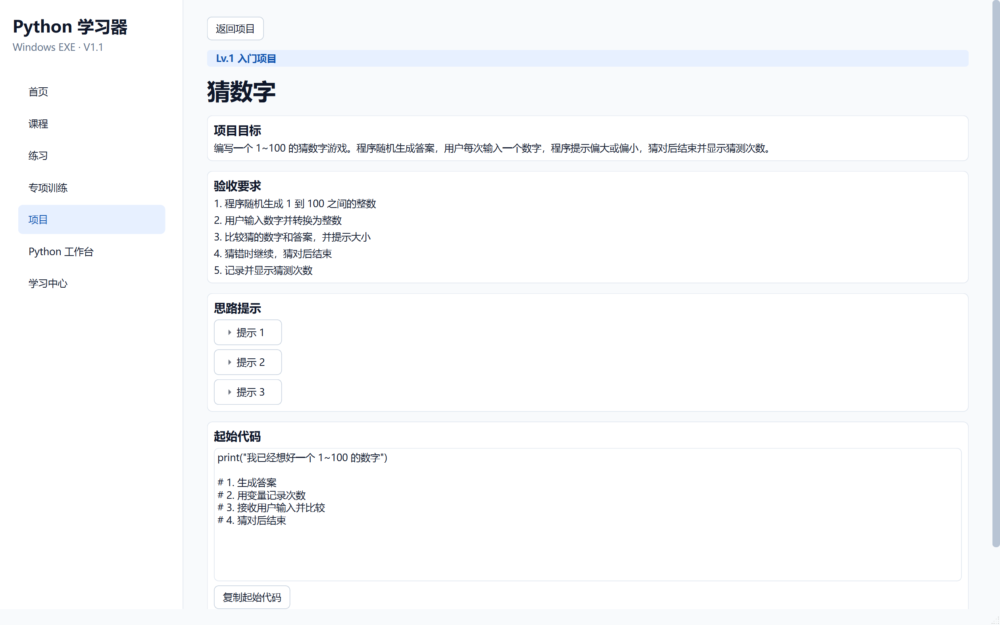
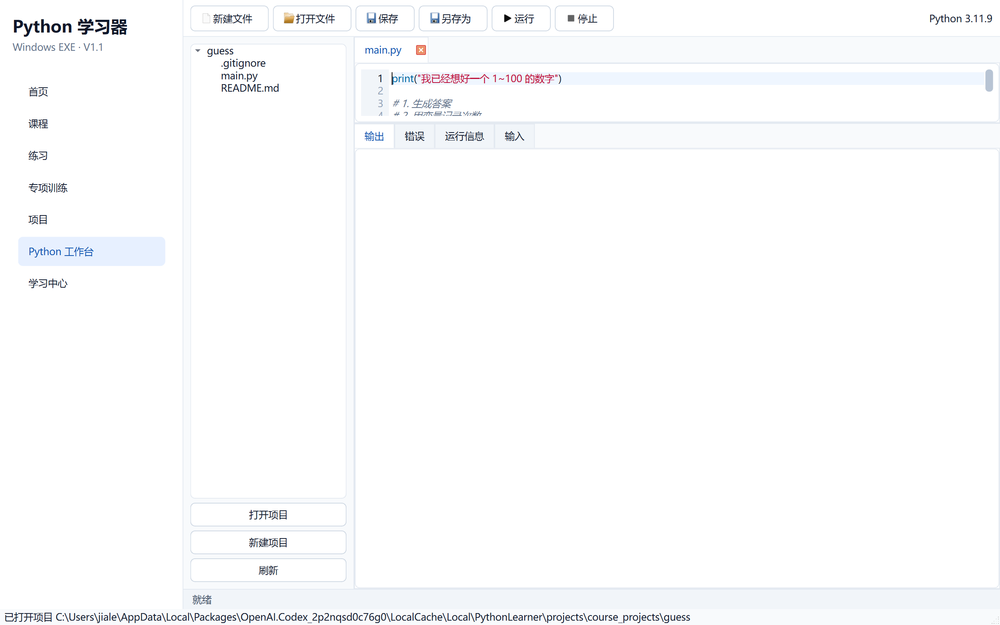

# 阶段 4 验收记录：项目实战系统

验收日期：2026-09-13

## 开发范围

- 13 个项目
- Lv.1 到毕业项目分组
- 项目目标、验收要求、知识点和分级提示
- 起始代码
- 项目工作区创建
- 与 Python 工作台联动
- 项目完成进度持久化

## 验收清单

- [x] 侧边栏增加“项目”
- [x] 项目页显示 13 个项目
- [x] 项目按 Lv.1 到毕业项目分组
- [x] 项目详情显示目标和验收要求
- [x] 项目详情显示关联知识点
- [x] 提示可以逐条展开
- [x] 项目只提供起始代码，不提供完整答案
- [x] 可以创建项目工作区
- [x] 工作区包含 `main.py`、`README.md` 和 `.gitignore`
- [x] 再次进入工作区不会覆盖用户代码
- [x] 可以打开工作台继续编辑
- [x] 项目完成后状态持久保存
- [x] 首页和学习中心同步显示项目进度

## 自动测试证据

执行：

```powershell
.\.venv\Scripts\python.exe -m pytest
```

结果：

```text
37 passed
```

阶段专项测试位于：

```text
tests/test_projects.py
```

## 打包验收

- [x] `dist\PythonLearner\PythonLearner.exe` 启动后窗口标题为“Python 学习器”
- [x] 打包后的主程序响应正常
- [x] `PythonWorker.exe` 中文输出按 UTF-8 字节验证通过
- [x] 中文输出内容为 `欢迎学习 Python`

## 界面验收截图






