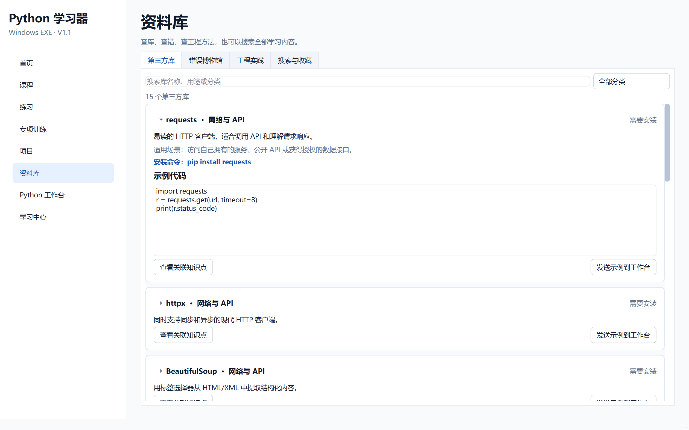
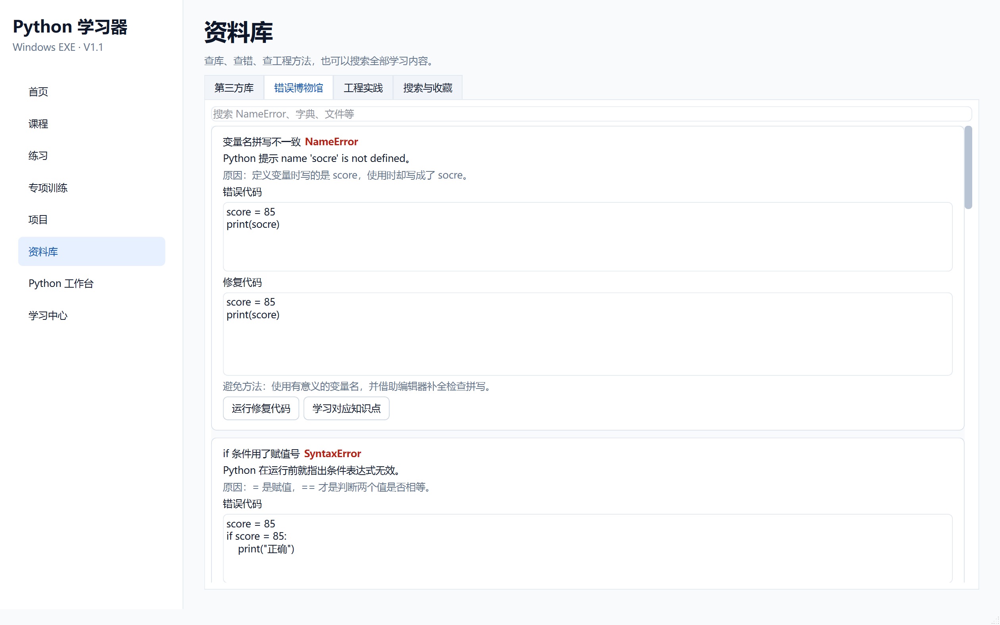
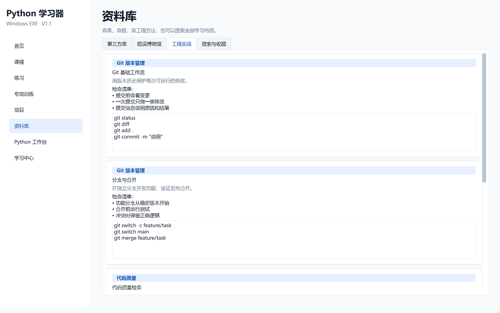
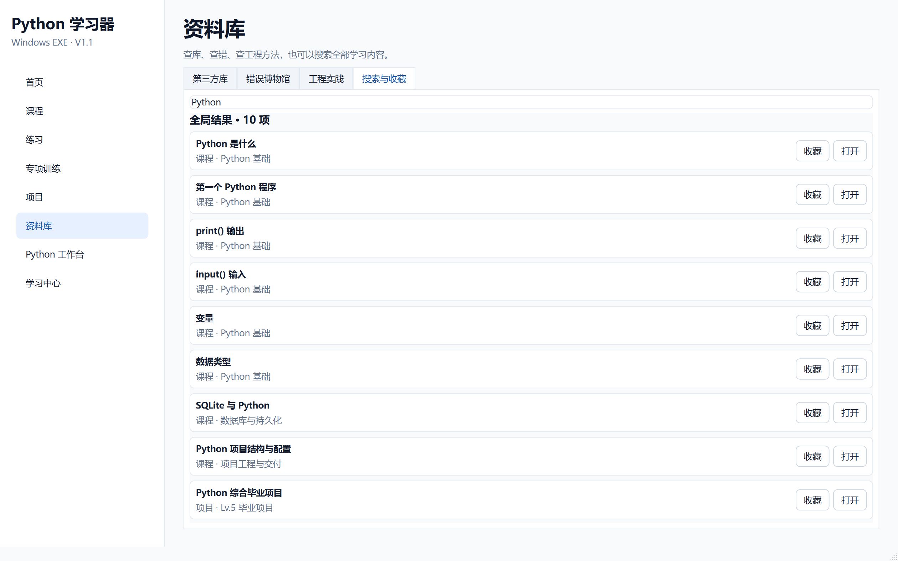

# 阶段 5 验收记录：资料库与工具系统

验收日期：2026-09-13

## 开发范围

- 第三方库目录
- 错误博物馆
- 工程实践
- 全局搜索
- 收藏持久化
- 与课程、训练、项目和工作台联动

## 验收清单

- [x] 侧边栏完整显示 8 个导航项
- [x] 资料库包含第三方库、错误博物馆、工程实践、搜索与收藏
- [x] 第三方库包含 15 个条目
- [x] 第三方库按网络、数据、数据库、Web、测试、AI、工具分类
- [x] 第三方库显示安装命令、用途和示例代码
- [x] 第三方库显示当前环境是否可导入
- [x] 点击第三方库标题可以展开完整详情
- [x] 分类下拉框与浅色/深色主题保持一致
- [x] 错误博物馆包含 8 类高频错误
- [x] 错误博物馆显示表现、原因、错误代码、修复代码和避免方法
- [x] 工程实践包含 Git、代码质量和测试模块
- [x] 全局搜索覆盖课程、项目、训练、第三方库、错误和工程实践
- [x] 搜索结果可以跳转到对应内容
- [x] 收藏可以保存并在重新启动后恢复
- [x] 示例和修复代码可以发送到 Python 工作台

## 自动测试证据

执行：

```powershell
.\.venv\Scripts\python.exe -m pytest
```

结果：

```text
39 passed
```

阶段专项测试位于：

```text
tests/test_toolbox.py
```

## 打包验收

- [x] `dist\PythonLearner\PythonLearner.exe` 启动后窗口标题为“Python 学习器”
- [x] 打包后的主程序响应正常
- [x] `PythonWorker.exe` 中文输出按 UTF-8 字节验证通过
- [x] 资料库、错误博物馆、工程实践和搜索模块已包含在打包版本中
- [x] 第三方库分类下拉框与浅色主题一致
- [x] 点击第三方库标题可展开安装命令和示例代码

## 界面验收截图








