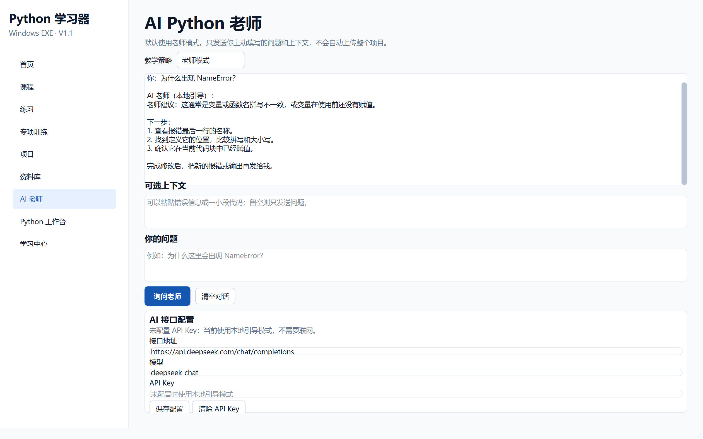

# 阶段 6 验收记录：AI Python 老师

验收日期：2026-09-13

## 开发范围

- 老师模式、只给思路、只指出错误、直接答案
- 无 API Key 的本地引导
- OpenAI 兼容接口调用
- 后台请求，不阻塞界面
- Windows DPAPI 加密保存 API Key
- 隐私提示和用户主动提供上下文

## 验收清单

- [x] 侧边栏增加“AI 老师”
- [x] 默认教学模式为“老师模式”
- [x] 无 API Key 时本地引导可以正常回答
- [x] 四种教学模式可以切换
- [x] 本地老师模式不会直接给完整项目答案
- [x] 用户主动填写的问题才会发送
- [x] 用户主动粘贴的上下文才会发送
- [x] 不会自动上传整个项目目录
- [x] 远程请求在后台线程执行
- [x] API 地址和模型可以配置
- [x] API Key 使用 Windows DPAPI 加密保存
- [x] 设置 JSON 中不会出现明文 API Key
- [x] 模型服务失败时回退到本地引导并显示错误原因
- [x] AI 提问次数会写入本地设置

## 自动测试证据

执行：

```powershell
.\.venv\Scripts\python.exe -m pytest
```

结果：

```text
43 passed
```

阶段专项测试位于：

```text
tests/test_ai_teacher.py
```

## 打包验收

- [x] `dist\PythonLearner\PythonLearner.exe` 启动后窗口标题为“Python 学习器”
- [x] 打包后的主程序响应正常
- [x] AI 的 ctypes/DPAPI 依赖已包含在打包版本中
- [x] `PythonWorker.exe` 中文输出按 UTF-8 字节验证通过

## 界面验收截图


