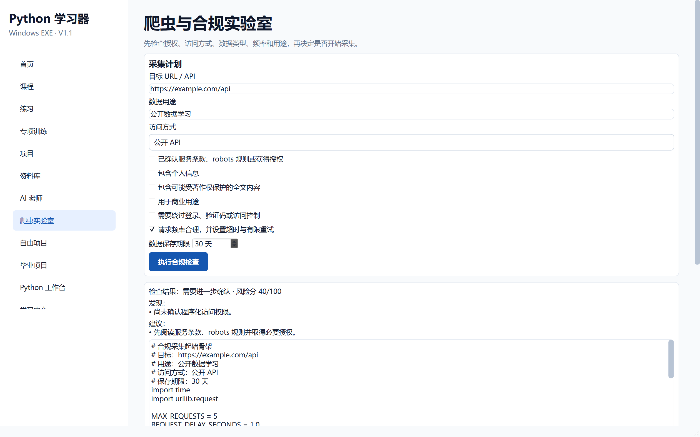

# 阶段 7 验收记录：爬虫与合规实验室

验收日期：2026-09-13

## 开发范围

- 授权与访问方式检查
- 数据类型、频率、保存期限和商业用途评估
- 风险评分与强制阻断条件
- robots.txt 规则判断
- 法律地区选择
- 安全起始代码和工作台联动

## 验收清单

- [x] 侧边栏增加“爬虫实验室”
- [x] 访问方式包含公开 API、公开页面、自己的登录会话和尚未确认
- [x] 可以检查授权、个人信息、著作权、商业用途和访问频率
- [x] 绕过访问控制会被直接判断为高风险
- [x] 风险评分覆盖 0 到 100
- [x] 检查结果显示发现问题和必须采取的措施
- [x] 可以粘贴 robots.txt 并判断目标 URL 是否允许当前 User-Agent
- [x] 未输入完整 URL 时给出明确提示
- [x] 法律地区可以保存
- [x] 页面明确声明不构成法律意见
- [x] 生成的安全起始代码包含最大请求数、延迟、超时和数据用途
- [x] 安全起始代码可以发送到 Python 工作台

## 自动测试证据

```text
51 passed
```

阶段专项测试：

```text
tests/test_crawler.py
```



