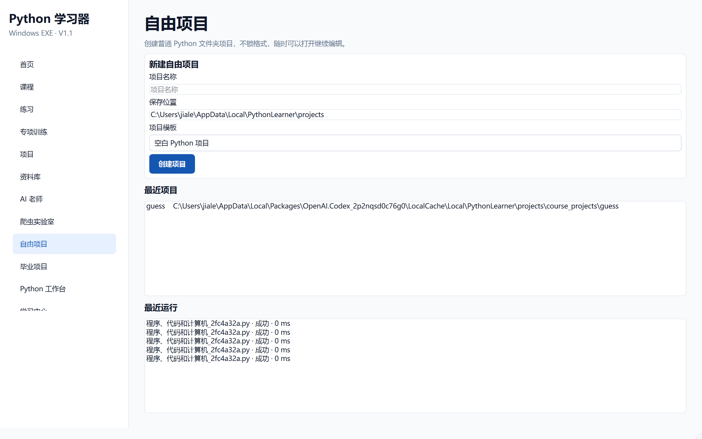

# 阶段 8 验收记录：自由项目

验收日期：2026-09-13

## 开发范围

- 空白 Python 项目
- 基础 Python 项目
- 带测试项目结构
- 最近项目
- 最近运行记录
- 工作台联动

## 验收清单

- [x] 侧边栏增加“自由项目”
- [x] 可以创建空白 Python 项目
- [x] 可以创建基础 Python 项目
- [x] 可以创建带 `tests/`、`pytest` 和开发依赖文件的项目
- [x] 项目是普通 Windows 文件夹
- [x] 创建后自动进入 Python 工作台
- [x] 最近项目显示并可双击打开
- [x] 最近运行记录显示并可打开对应目录
- [x] 用户已有代码不会被模板覆盖

## 自动测试证据

```text
51 passed
```

阶段专项测试：

```text
tests/test_free_graduation.py
```



