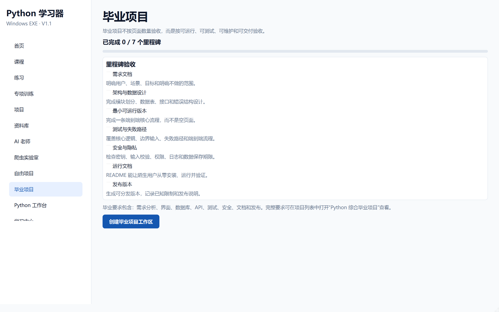

# 阶段 9 验收记录：毕业项目

验收日期：2026-09-13

## 开发范围

- 七个毕业里程碑
- 项目工作区脚手架
- 需求、源码、测试和文档目录
- 毕业项目完成状态
- 与项目系统和学习进度联动

## 验收清单

- [x] 侧边栏增加“毕业项目”
- [x] 包含需求文档、架构设计、最小版本、测试、安全、文档和发布
- [x] 里程碑可以勾选并持久保存
- [x] 显示毕业项目完成进度
- [x] 七个里程碑全部完成后自动标记毕业项目完成
- [x] 可以创建毕业项目工作区
- [x] 工作区包含 `src/`、`tests/`、`docs/`
- [x] 工作区包含 `main.py`、`test_main.py`、需求文档和开发依赖文件
- [x] 再次创建工作区不会覆盖用户文件
- [x] 项目完成状态同步到首页、项目页和学习中心

## 自动测试证据

```text
51 passed
```

阶段专项测试：

```text
tests/test_free_graduation.py
```



